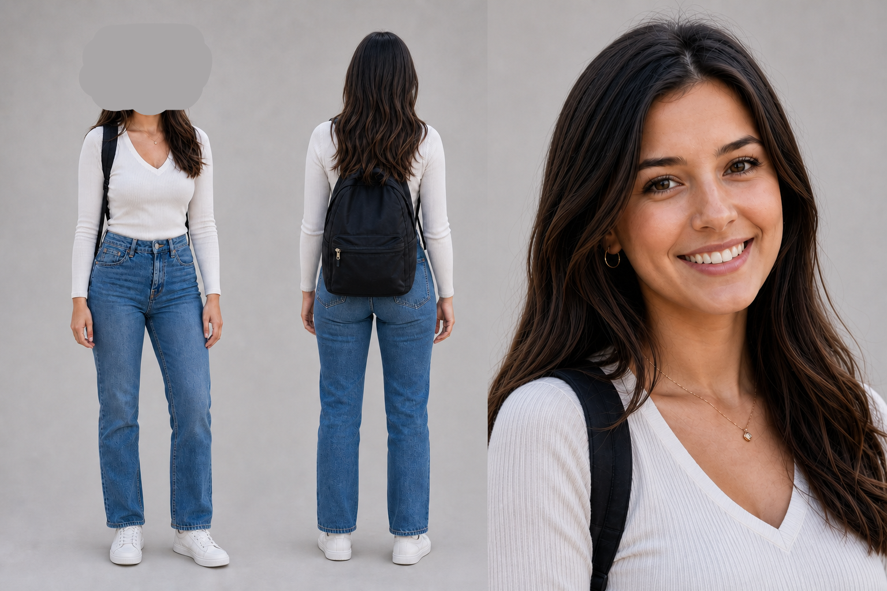

# Character Sheet Skills

This repository contains two complementary character-sheet skills. Choose the skill that matches the subject: `character-sheet` for stylized game, anime, and cartoon characters, or `character-sheet-simple` for realistic people.

## `character-sheet`

`character-sheet` is an agent skill for generating a single production-oriented character sheet from a written brief and optional reference images. It is optimized for game, anime, and cartoon characters.

The skill creates one readable landscape image containing consistent front, side, and back views, facial expressions, design details, and a color palette. It prioritizes cross-view identity consistency over decorative presentation.

### Features

- Generates a complete character sheet from a text brief
- Uses one or more character images as identity references
- Accepts a separate layout image without mixing it into the character identity
- Includes full-body front, side, and back views
- Includes four to six expressions
- Adds hair, eye, costume, shoe, and accessory callouts
- Adds four to eight key color swatches
- Performs a visual QA pass and, when needed, one targeted correction

### Best-fit use cases

Use this skill for:

- game character model sheets
- anime production character sheets
- cartoon character turnarounds
- original-character reference sheets
- expression and costume reference pages

The workflow is designed around stylized characters. It can be used for photorealistic people, but facial likeness, anatomy, clothing continuity, and cross-view consistency may be less reliable. A photography- or identity-specialized workflow may be a better choice for realistic human sheets.

Do not use this skill for a single illustration, story scene, poster, or general concept-art request that does not need multiple views.

### Quick start

```text
$character-sheet
Create a game-ready character sheet for a calm teenage shrine guardian.
She has long straight black hair, a red ribbon, and a white-and-navy layered outfit.
Include full-body front, side, and back views, six expressions, costume details,
and a color palette on a clean white background.
```

With a character reference:

```text
$character-sheet
Use the attached image as the character identity reference.
Preserve the hairstyle, face, eye color, silhouette, outfit construction,
accessories, shoes, and colors. Create one character sheet with front, side,
and back views, six expressions, detail callouts, and a color palette.
```

When supplying both character and layout references, label their roles clearly:

```text
Image A: character identity reference. Preserve this design.
Image B: layout reference only. Use its panel organization, not its character.
```

### Expected output

The default deliverable is one landscape raster image with a white or very light neutral background. It should contain:

1. full-body `FRONT`, `SIDE`, and `BACK` views;
2. four to six readable expressions;
3. hair, eye, costume, shoe, and accessory details; and
4. four to eight key color swatches.

If space is limited, the required turnaround views and identity consistency take priority over an optional three-quarter view, long labels, or decoration.

### Example output

This example combines front, side, and back views with six expressions, detail callouts, and a color palette.


## `character-sheet-simple`

`character-sheet-simple` creates character sheets optimized for using real-person references in AI video generation. It deliberately includes only a full-body front view, a full-body back view, and a detailed face close-up.

### Why the sheet is intentionally simple

As video models become more capable at reasoning over references, effective character sheets depend less on communicating every possible detail and more on clearly identifying the elements that must remain fixed. Leaving fine-grained visual decisions to the video model generally produces better results than over-specifying the reference sheet.

Game, anime, and comic characters are often designed with much more visual complexity than real people, so the more detailed `character-sheet` format can help preserve their consistency. However, `character-sheet-simple` can also be the better choice for a stylized character when the goal is to preserve only the character's appearance and body shape while changing the outfit or omitting minor accessories.

### Recommended post-processing

One recommended technique is to intentionally remove or obscure the face in the full-body front view after generating the sheet, as shown in the example below. This prevents a video model from relying on the lower-resolution face in the full-body image instead of the high-resolution face close-up, which can otherwise reduce facial detail.

### Example output

In this example, the face in the full-body front view has been intentionally obscured during post-processing. The face close-up remains the sole high-detail facial reference.



## Compatibility

Both skills are optimized for Codex because their default workflows use Codex's `imagegen` skill and built-in image generation tool.

Other agents, including Claude and custom agents, can still use the instructions in each skill's `SKILL.md`, but they must map the generation step to either:

- an image-generation skill or tool available in that agent environment; or
- an external image-generation API configured and authorized for that agent.

Tool names, reference-image attachment methods, and edit workflows differ between agents. Non-Codex agents should preserve each skill's prompt structure and output requirements while adapting the tool-specific steps.

## Installation

Copy either or both skill directories into the location your agent uses for skills, or make the agent load the corresponding `SKILL.md` directly:

```text
skills/content/character-sheet/
skills/content/character-sheet-simple/
```

For Codex, install or link the desired directory as a discoverable skill, then invoke it as `$character-sheet` or `$character-sheet-simple`.

## Repository contents

- [`character-sheet` instructions](skills/content/character-sheet/SKILL.md)
- [`character-sheet` usage guide](skills/content/character-sheet/README.md)
- [Character brief template](skills/content/character-sheet/references/brief-template.md)
- [Image prompt guide](skills/content/character-sheet/references/prompt-guide.md)
- [`character-sheet-simple` instructions](skills/content/character-sheet-simple/SKILL.md)
- [`character-sheet` example output](examples/character-sheet-test.png)
- [`character-sheet-simple` example output](examples/character-sheet-simple-reference.png)
