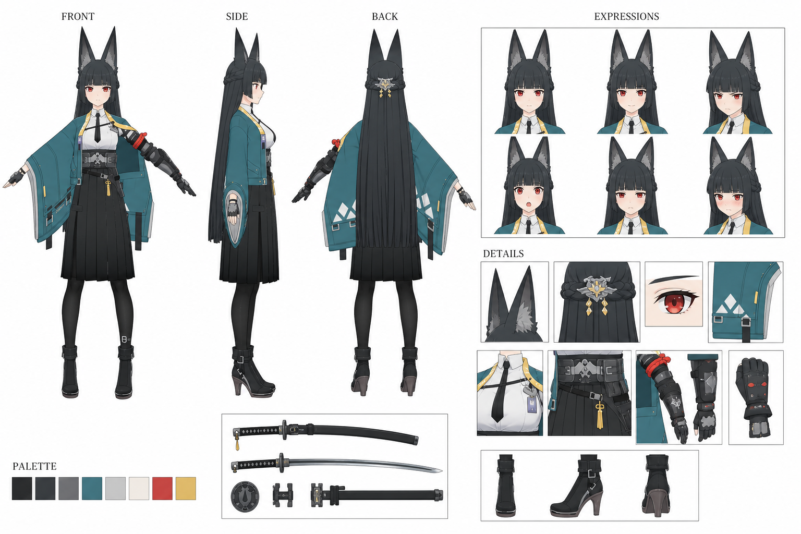

# Character Design Sheet

Codex built-in image generation을 사용한 anime character settei Skill 구현과 테스트 결과입니다.

- Skill: [acg-character-settei-codex](skills/content/acg-character-settei-codex/)
- 테스트 결과: [character-sheet-test.png](examples/character-sheet-test.png)

이 테스트는 3개의 로컬 레퍼런스를 사용했습니다. 가장 완전한 캐릭터 turnaround 이미지는 identity anchor, 나머지 자료는 보조 identity 및 layout/component reference로 사용했습니다. 결과는 front/side/back 전신, 표정 6종, 디테일 callout, 색상 팔레트를 포함하는 한 장의 설정화입니다.
